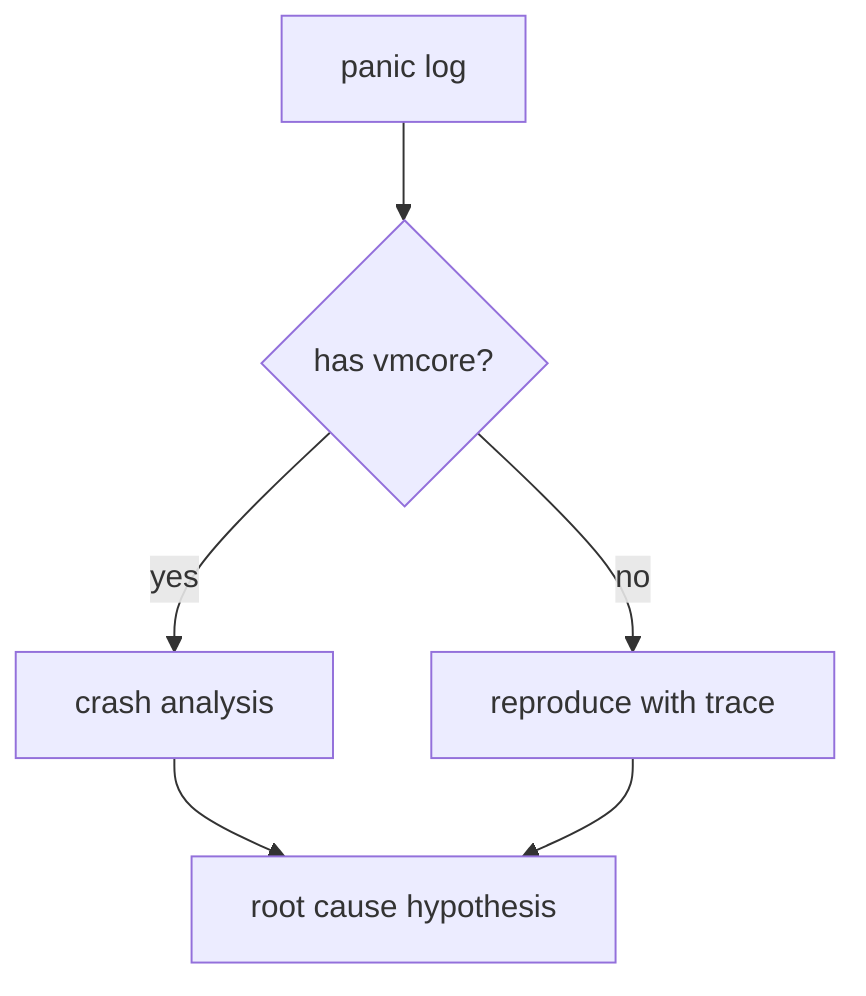
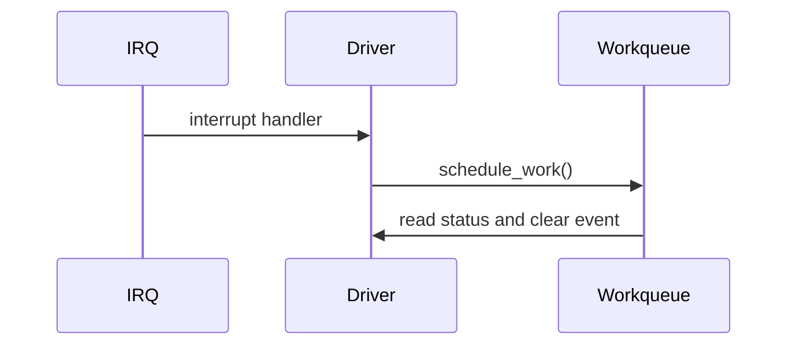

这是一篇专门用于验证本站 Markdown 渲染能力的文章。它覆盖当前生成器支持的主要语法，包括基础 Markdown、技术写作常用扩展，以及浏览器端渲染的 Mermaid 和 MathJax。

如果这篇文章显示正常，说明后续写内核分析文章时可以放心使用这些格式。

## 行内格式

普通段落可以包含 **粗体文本**、*斜体文本*、`行内代码`，也可以包含链接，例如 [Linux kernel documentation](https://docs.kernel.org/)。

内核文章里常见的行内写法：

- 函数名：`start_kernel()`
- 配置项：`CONFIG_DEBUG_KMEMLEAK`
- 命令：`git bisect run`
- 路径：`/sys/kernel/debug/kmemleak`

## 无序列表

无序列表适合记录排查点：

- 保存完整串口日志
- 记录内核版本和 config
- 确认 dtb 是否为运行时实际加载版本
- 保留 vmlinux、System.map 和模块符号

## 有序列表

有序列表适合记录流程：

1. 确认问题是否稳定复现
2. 定义 good 和 bad 版本
3. 固定 config、dtb、rootfs 和 toolchain
4. 执行 bisect
5. 对 first bad commit 做 revert/cherry-pick 验证

## 表格

适合记录寄存器字段、调试步骤、工具对比和状态机。

| 场景 | 工具 | 关注点 |
| --- | --- | --- |
| 崩溃分析 | crash | 栈、对象、slab、任务状态 |
| 内存泄漏 | kmemleak | 不可达对象 |
| 回归定位 | git bisect | good/bad 判定 |

## 引用块

引用块适合记录原则、结论或 review 规则。

> 不要把 faulting instruction 直接当作根因。它只是第一个把错误状态暴露出来的位置。

也可以连续写多行引用：

> 先判断问题处在哪个阶段。
> 如果阶段不清楚，调试动作很容易跑偏。

## 分隔线

下面是一条分隔线，用于隔开两个较大的内容段落。

---

分隔线之后的内容应该重新开始一个独立段落。

## 图片

下面使用站点已有的 hero 图片做验证。图片应该自适应正文宽度，并保持圆角。


## 数学公式

行内公式使用 `\\( ... \\)`，例如 \\( T = f^{-1} \\)。

块级公式使用 `$$`：

$$
latency = t_{irq} + t_{sched} + t_{work}
$$

也可以写更接近工程估算的表达式：

$$
T_{boot} = T_{firmware} + T_{kernel} + T_{init} + T_{services}
$$

数学公式由 MathJax 在浏览器端渲染。

## Mermaid 流程图

使用 `mermaid` 代码块即可：



这适合画启动流程、probe 顺序、错误路径和调试决策树。

## Mermaid 时序图



## 代码块

代码块可以带语言标记。当前站点保留语言 class，后续可以继续接入语法高亮库。

```c
rcu_read_lock();
obj = rcu_dereference(global_obj);
if (obj)
        use(obj);
rcu_read_unlock();
```

Shell 示例：

```sh
git bisect start
git bisect bad v6.8
git bisect good v6.7
```

普通文本代码块：

```text
panic: unable to handle kernel NULL pointer dereference
pc : foo_irq_handler+0x48/0x120
lr : __handle_irq_event_percpu+0x64/0x1b0
```

## 混合示例

下面这个小节混合表格、公式和结论，模拟真实技术文章的一段。

| 阶段 | 观测项 | 判断 |
| --- | --- | --- |
| IRQ | 中断次数 | 是否持续增长 |
| NAPI | poll 次数 | 是否被调度 |
| DMA | descriptor | 是否及时回收 |

如果 \\( RX_{packets} \\) 增长但 \\( userspace_{read} \\) 不增长，问题可能不在 PHY，而在 socket 消费或协议栈路径。

> 真实排查时，不要只看一个计数器。计数器之间的关系比单个数值更重要。

## 结论

如果本文中的表格、引用、图片、分隔线、Mermaid 图、MathJax 公式、列表和代码块都显示正常，说明本站当前 Markdown 能力已经覆盖大多数内核技术文章的表达需求。

后续如果需要脚注、任务列表、自动链接或更完整的 GFM 语法，可以继续在当前生成器上扩展，或者切换到成熟 Markdown 渲染库。
